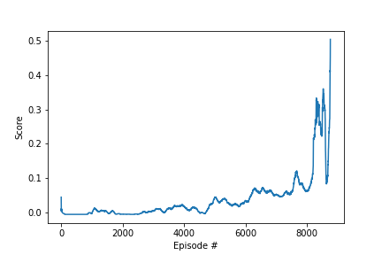

# Project 3: Collaboration and Competition
 
## Introduction
 
In this environment, two agents control rackets to bounce a ball over a net. If an agent hits the ball over the net, it receives a reward of +0.1.  If an agent lets a ball hit the ground or hits the ball out of bounds, it receives a reward of -0.01.  Thus, the goal of each agent is to keep the ball in play.
 
The observation space consists of 8 variables corresponding to the position and velocity of the ball and racket. Each agent receives its own, local observation.  Two continuous actions are available, corresponding to movement toward (or away from) the net, and jumping.
 
The task is episodic, and in order to solve the environment, your agents must get an average score of +0.5 (over 100 consecutive episodes, after taking the maximum over both agents). Specifically,
 
- After each episode, we add up the rewards that each agent received (without discounting), to get a score for each agent. This yields 2 (potentially different) scores. We then take the maximum of these 2 scores.
- This yields a single **score** for each episode.
 
The environment is considered solved, when the average (over 100 episodes) of those **scores** is at least +0.5.
 
 
## DDPG
 
### Approach
Although I used Deep Deterministic Policy Gradient in the previous project I wanted to see the result of the same agent. I just used a single agent that I feed with data from both players.
 
### Hyperparameters
I haven't changed any hyperparameters and the result was a success.
 
```python
BUFFER_SIZE = 100000    # replay buffer size
BATCH_SIZE = 256        # minibatch size
GAMMA = 0.99            # discount factor
TAU = 1e-3              # for soft update of target parameters
LR_ACTOR = 1e-3         # learning rate of the actor
LR_CRITIC = 1e-3        # learning rate of the critic
WEIGHT_DECAY = 0.0      # L2 weight decay
 
EXPLORATION_DECAY = 0.999999
EXPLORATION_MIN = 0.01
LEARN_FREQUENCY = 20*20
LEARN_COUNT = 10
```
 
### Results
The  is available there.
 
How we can see the two players have the same style of play. This is normal because it is the same agent which is actually playing.
 
![Result] (https://github.com/Vinssou/Tennis/blob/master/tennis.gif)
 
This environment has been solved in 26189 episodes.

 
### Conclusion
The implemented DDPG algorithm seemed quite robust, without any tuning the Tennis environment was solved directly.
 
## MADDPG
 
### Approach
I wanted to try to implement the . In the DDPG approach I used only one agent so I was pretty sure I couldn't get a better result with MADDPG. If I had used two different agents in the DDPG solution I could have thought MADDPG could be better. But here I was feeling this won't do a fair comparison.
 
### Architecture
To implement MADDPG I started from my DDPG code, and changed the program architecture.
 
#### Neural Network
I modified the Critic network. Instead of having one action, and one state, it has n actions and n states, n being the number of agents.
 
#### MADDPG class
I created a new class MADDPG which contains all the DDPG agents. The MADDPG has also a replay buffer to store the agents experience and a  to add some noise. 
 
### Hyperparameters
By using the same hyperparameters I solved MADDPG in around 10000 episodes. Much faster than using DDPG. I was really surprised by these results. Then I started to tune them and managed to solve it in 8656 episodes.
 
```python
BUFFER_SIZE = 100000    # replay buffer size
BATCH_SIZE = 128        # minibatch size
GAMMA = 0.95            # discount factor
 
EXPLORATION_DECAY = 0.999995
EXPLORATION_MIN = 0.01
LEARN_FREQUENCY = 20
LEARN_COUNT = 10
 
TAU = 1e-3              # for soft update of target parameters
LR_ACTOR = 1e-4         # learning rate of the actor
LR_CRITIC = 1e-4        # learning rate of the critic
WEIGHT_DECAY = 0.0      # L2 weight decay
```
 
I increase the learning frequency, decreasing the learning rate of both actor and critic. I also decrease the exploration decay and batch size.
 
### Results
Compared to the previous animation, we can see the two players are playing differently. They are using different agents even if both use shared data for the critic.
![Result] (tennis.gif)
 
This environment has been solved in 8656 episodes.

 
### Conclusion
MADDPG was surprisingly good in this multi agent environment. I managed to decrease the number of episodes by changing approach and by tuning the hyperparameters.
 
## Future Work
 
### Improvement
An improvement could be to use the D3QN for the critic and use the Prioritized Replay Buffer. I implemented both  so I could plug them to see if they can reduce the number of episodes to solve this environment.
 
### Using Unity
In this environment we have only two agents and they are collaborating. Some additional experiences could be used for competitive agents and collaborative one in the same environment. I adapted this MAD DOG to work in discrete space in the . In this environment we can find the collaboration and the competition. The additional challenge in this environment it is that the action space of the various agent don't have the same space. So it is not so easy to adapt but still feasible. The first approach I am using is having two MADDPG agents, for each type.
 
### Using Cogment
I am currently working at  on  a high-efficiency, open source framework designed to enable the training of models in environments where humans and agents interact with the environment and each other continuously. It’s capable of distributed, multi-agent, multi-model training. So I will continue to implement agents in a multi-agent environment.
 

